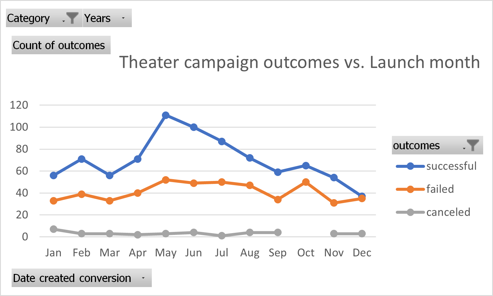
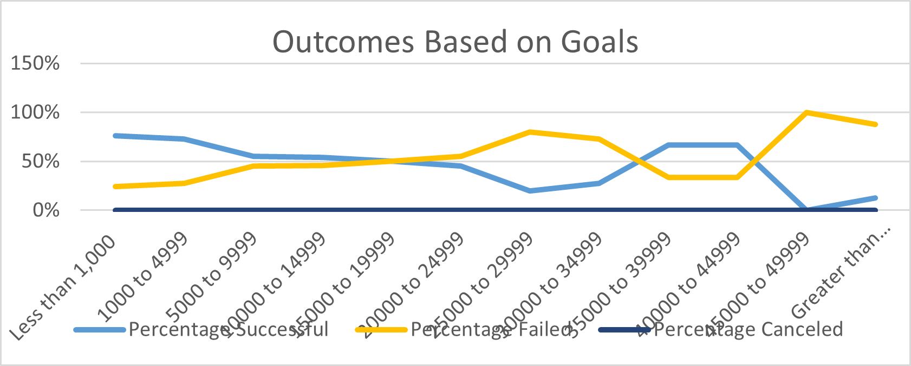

# Kickstarting with Excel

## Overview of Project
* This project analyses various Kickstarter campaigns, with a specific emphasis on Theater and Plays

### Purpose
* This analysis helps understand how different theater and play campaigns fare in relation to their launch dates and their funding goals---

## Analysis and Challenges

### Analysis of Outcomes Based on Launch Date
* 

### Analysis of Outcomes Based on Goals
* 

### Challenges and Difficulties Encountered

## Results

- What are two conclusions you can draw about the Outcomes based on Launch Date?
    * Most successful theater campaigns happened in May---
    * Trend is for success to rise from Jan to May and then to slowly decline in the months thereafter---
    * Failed theater campaigns range from 31 to 50 on a monthly basis---
    * Except in October (o canceled) and in January (7 canceled), a handful of theater campaigns were canceled monthly---

- What can you conclude about the Outcomes based on Goals?
    * No plays were cancelled---
    * Plays with goals less than 20,000 had at least a 50% chance of being successful---
    * Size of goals, by itself, doesn't explain why certain campaigns are successful---

- What are some limitations of this dataset?
    * This data is limited to three year: 2014, 2015 and 2016

- What are some other possible tables and/or graphs that we could create?
    * Outcomes vs. Average donation
    * Outcomes vs. Duration
